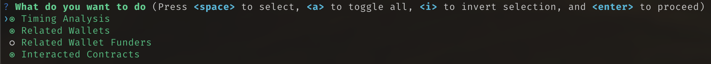
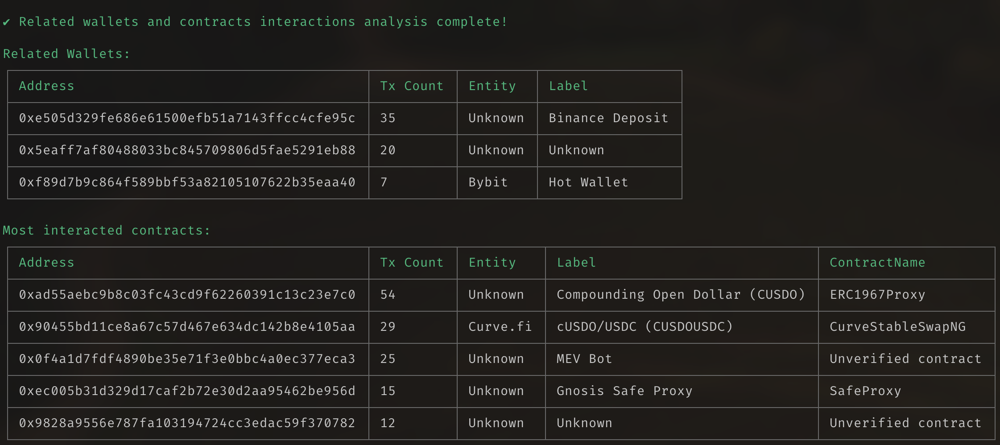

# Wallet tracker CLI

A command-line interface for analyzing ethereum addresses.

## Installation (didn't test, only use dev mode for now)

```bash
npm install -g .
```

## Development

1. Copy `.env.example` to `.env` and fill in the variables (see config section for more details)

2. Install dependencies

```bash
npm install
```

3. Run the CLI

```bash
npm run dev <address>
```



## Current features

For old addresses or addresses with a lot of activity, the analysis might take a while (several minutes).

### Transaction timing analysis

* Busiest periods
* Work window / Sleep window
* Inferred timezone
* Tx distribution

### Related wallets analysis

* Related wallets. Based on txs and outflows with some heuristic to weed out scam transactions. 
* Arkham entity/labels

### Interacted contracts analysis

* Get most interacted contracts



### Related wallets funder wallet analysis

* For each related wallet, get the funder wallet


## Configuration

<!-- Create a `.env` file in your home directory with the following variables: -->

```env
ETHERSCAN_API_KEY=your_etherscan_api_key
ALCHEMY_API_KEY=your_alchemy_api_key
ARKHAM_COOKIE=your_arkham_cookie
```

The arkham cookie can be found opening the developer tools in the "Network" tab of your browser's developer tools (go to intel.arkm.com, browse around a bit, open developer tools, go to "Network" tab, type https://api.arkm.com/ in the search bar, click on any request, go to "Headers" tab, copy the cookie value in the "Request Headers" section).

## TODO

### Improvements
- Optimizations:
  - Some hypersync queries can be batched
  - Treat related wallets with high tx counts differently (skip costly analyses)
  - Caching layer for etherscan/arkham
- Improved heuristic for related wallets. 
- Check if there is way to use Nansen/Etherscan free
- Cache last analysis selected options 

### Additional features
- Wallet similarity analysis between 2 wallets and calculate 1) tx timing similarity score 2) interacted contracts similarity score
- Column with total net inflow/outflow to related wallets. Only considering major tokens like USDC, USDT, ETH, WETH, WBTC, etc. to simplify. Maybe a good feature to distinguish which wallets are really related.
- Embedded DB (sqlite?) with labels from github. Also ofac lists/apis.
- Related wallets first tx date
- Export report to PDF
- Export transactions/inflow/outflows to CSV
- More data on interacted contracts (most called functions?)
- Contract analysis command - instead of analyzing an EOA, another command to analyze a contract. Not sure if useful.
- Bridging tracking ? Seems hard.
- ?

### Issues
 - Would like to have etherscan/arkham/dbank/twitter address links in table outputs but this seems hard to do.
 - Some arkham MEV bot labels seem to be wrong (ex 0x0f4a1d7fdf4890be35e71f3e0bbc4a0ec377eca3)
 - Some contracts (Gnosis Safe, Rabby Fee Wallet? and other smart wallets) should probably be included in the "EOA category" and not in the contract interaction category.
 - Middle-east (Dubai) time maybe too close to both Asia/Europe to be distinguishable in timing analysis.
 - Some functionality should be made multichain. For example when fetching contract names, we are currently only fetching from etherscan mainnet.